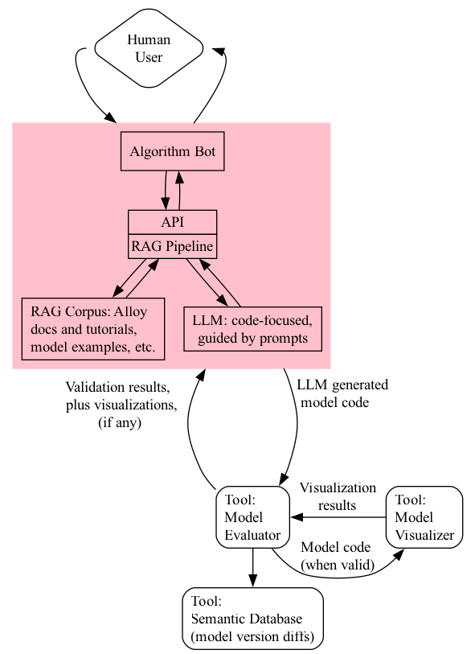

# About

This is the source and data for the app which serves as the main point of coordination between the human user and the various agents and tools.



# Initial Setup

## Activate the virtual environment:

```sh
source .venv/bin/activate
```

## Dependencies

*Only needed if ever want to recreate from scratch, without using the current [uv.lock](uv.lock)* - create a [uv project](https://docs.astral.sh/uv/#project-structure) as follows:

```sh
uv init --library --python 3.14
uv add uv add 'smolagents[toolkit,litellm,mcp,telemetry,gradio,docker]' \
  langchain \
  langchain-core \
  langchain-community \
  langchain-ollama \
  langchain-text-splitters \
  langchain-chroma \
  chromadb \
  sentence-transformers \
  pypdf \
  beautifulsoup4 \
  chardet \
  esprima \
  tree_sitter \
  'unstructured[local-inference]'
```

 
## Corpus Setup

The corpus folder contains the [retrieval-augmented generation (RAG)](https://en.wikipedia.org/wiki/Retrieval-augmented_generation) material for the Alloy generator LLM.

### 1. Examples of Alloy Models ([all-models.als](src/algobot/corpus/all-models.als))

Run [generate_model_examples.py](generate_model_examples.py) in the root of a clone of https://github.com/AlloyTools/models as follows:

```sh
$ python
>>> from generate_model_examples import concatenate_als_files
>>> concatenate_als_files(".", "./all-models.als")
```

### 2. [Practical Alloy](https://practicalalloy.github.io/) (online book)

Content retrieved and combined into a single PDF file ([practicalalloy-github-io.pdf](src/algobot/corpus/practicalalloy-github-io.pdf)) using [site2pdf](https://github.com/laiso/site2pdf) and docker ([colima](https://colima.run/)):

```sh
cd ~/repos/repos-git/site2pdf
colima start
docker build --tag site2pdf --file Dockerfile .
docker run --name site2pdf site2pdf https://practicalalloy.github.io/
docker container cp site2pdf:/app/out/practicalalloy-github-io.pdf .
colima stop
```
